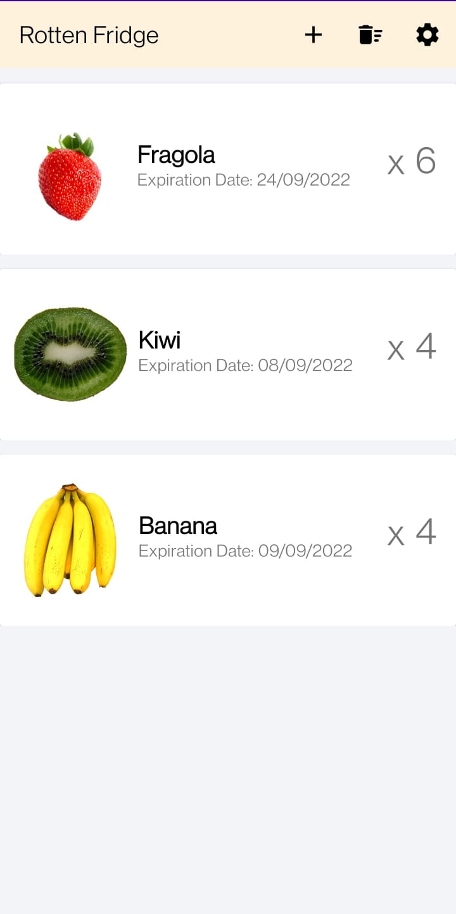
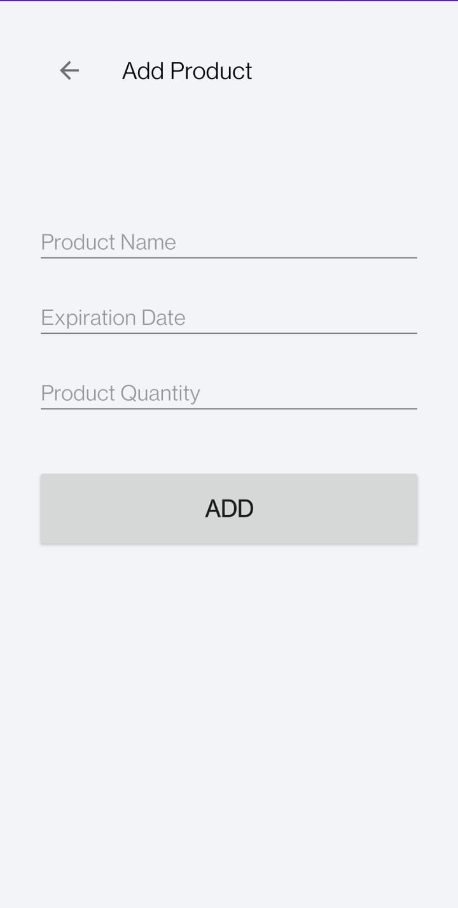
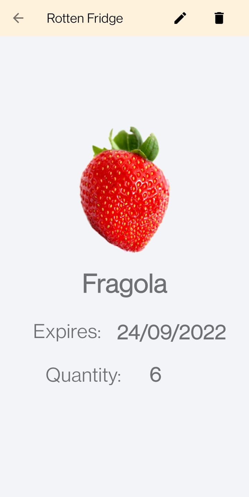
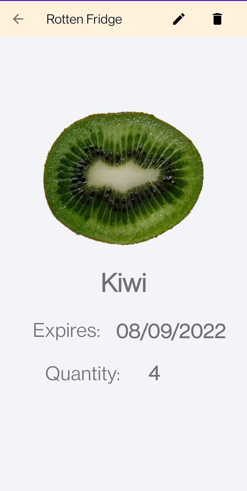

# RottenFridge

<a href="https://play.google.com/store/apps/details?id=com.MattiaBottini.rottenfridge"></img>
 </a>

## Rotten Fridge, l'app in grado di gestire il tuo frigorifero.

Rotten Fridge è un'app che permette di gestire la propria dispensa e il proprio frigorifero in modo virtuale. 
Si inseriscono i prodotti con relativa data di scadenza e quantità, successivamente l'app li mostrerà all'utente.

  
  
  
  

